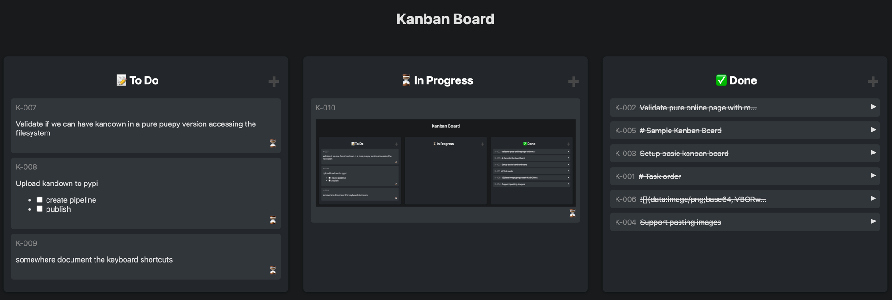

# Kandown

A simple, markdown-inspired Kanban board powered by YAML and Flask.



## 🎯 Try the Demo

Try Kandown instantly without installation! Visit our **[live demo](https://eruvanos.github.io/kandown/)** - all data is stored locally in your browser.

## Overview

Kandown is a lightweight web application for visualizing and managing 
tasks in a Kanban board format. 
Tasks are stored in a YAML file, making it easy to edit, version, and share your board.
The app features a clean, responsive web UI started by the CLI.

## Features

- 🗂️ **Kanban board UI**: Drag-and-drop tasks between columns (To Do, In Progress, Done)
- ✏️ **Markdown support**: Write task descriptions using Markdown syntax
- 🖼️ **Paste images**: Task descriptions support pasting images from clipboard
- 🗂️ **Image Storage**: Images can be embedded as base64 or saved to disk into an `.backlog` folder
- ✅ **Interactive checkboxes**: Clickable checkboxes in task descriptions
- 📄 **YAML-backed storage**: All tasks are stored in a simple YAML file
- 🔄 **Jetbrains IDE integration**: View and track tasks directly from JetBrains IDEs
- 🚀 **CLI**: Start the server, choose host/port/debug, auto-create YAML file if missing
- 🌐 **Demo mode**: Try it in your browser with localStorage backend (no server required)

## Installation

This project uses [uv](https://docs.astral.sh/uv/) for fast Python dependency management.

```bash
uv tool install git+https://github.com/eruvanos/kandown.git
```

## Usage

### Start the Kanban server

```bash
kandown [OPTIONS] [YAML_FILE]
```

- If no YAML file is provided, defaults to `backlog.yaml` (auto-created if missing).
- Open your browser to `http://127.0.0.1:5001` (default) to view the board.

#### CLI Options

```
Options:
  --host TEXT     Host to bind to (default: 127.0.0.1)
  --port INTEGER  Port to bind to (default: 5001)
  --debug         Enable debug mode
  --help          Show help message
```

#### Examples

```bash
# Start server with default YAML file (if exists)
kandown

# Start server with a custom YAML file on a custom port
kandown --port 5001 demo.yml
```

## Demo Mode

Kandown includes a **demo mode** that runs entirely in your browser without requiring a server. This mode is perfect for:

- **Quick trials**: Test Kandown without installing anything
- **Static hosting**: Deploy to GitHub Pages, Netlify, or any static host
- **Offline use**: Works completely offline after initial load
- **Privacy**: All data stays in your browser's localStorage

### Try the Live Demo

Visit **[https://eruvanos.github.io/kandown/](https://eruvanos.github.io/kandown/)** to try the demo mode immediately.

### Build and Run Demo Locally

To build and run the demo mode on your local machine:

```bash
# Build the demo (copies static assets)
python scripts/build_demo.py

# Serve the demo locally
python -m http.server 8080 --directory demo

# Open http://localhost:8080 in your browser
```

### Demo Mode Features

The demo mode includes all core features:
- ✅ Drag-and-drop task management
- ✅ Markdown rendering
- ✅ Image paste support (stored as base64)
- ✅ Task tags and types
- ✅ Dark mode
- ✅ Data persistence via localStorage
- ✅ Clear data option in settings

**Note**: In demo mode, data is stored in your browser's localStorage. Clearing browser data will delete all tasks.

### Deploy Your Own Demo

The demo can be deployed to any static hosting service. A GitHub Actions workflow is included to automatically deploy to GitHub Pages:

1. Enable GitHub Pages in your repository settings (Settings → Pages → Source: GitHub Actions)
2. Push to the `main` branch or trigger the workflow manually
3. The demo will be built and deployed automatically

## Jetbrains Task Integration

You can integrate Kandown with Jetbrains IDEs using the [Tasks & Contexts](https://www.jetbrains.com/help/idea/managing-tasks-and-context.html) feature.

To set up Kandown as a task server open the IDE settings and navigate to `Tools > Tasks > Servers`.
Add a new generic server with the following details:

- **General Settings**:
  - URL: `http://localhost:5001` (or your server URL)
  - Login Anonymously: Checked
- **Server Configuration**:
  - Task List URL: `http://localhost:5001/api/tasks`
  - Tasks: $
  - id: `id`
  - summary: `text`

## License

MIT License
